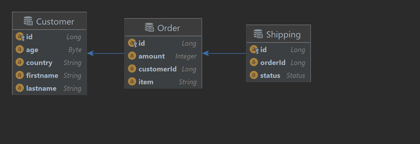

# Online store
[](https://www.oracle.com/java/technologies/downloads/#java17)
[](https://spring.io/projects/spring-boot)
[](https://maven.apache.org/)
[](https://your-swagger-url.com/)
[](https://www.h2database.com/html/main.html)
[](https://www.docker.com/)

### This is a RESTfull project - an online store that contains the entities of the customer, order and delivery. It is connected to In Memory database, implemented basic authentication using different roles to access resources



- REST API
    - [OpenAPI Spec](http://localhost:8083/swagger-ui/index.html)

## Requirements
* Java 17
* Maven 3.9.1 or above

## Getting started

Clone repository

```shell
https://github.com/pacgds1man/Online-Store
```

## Run the application with the command:

Maven:
```shell
mvn clean install
```


Create image for Docker
```shell
docker build -t online-store:0.0.1 .
```
Run the container
```shell
docker run -d -p 8083:8083 -t online-store:0.0.1
```
The application is running on port 8083.


## Basic auth credentials:
User
- username: user
- password: user

Admin
- username: admin
- password: admin